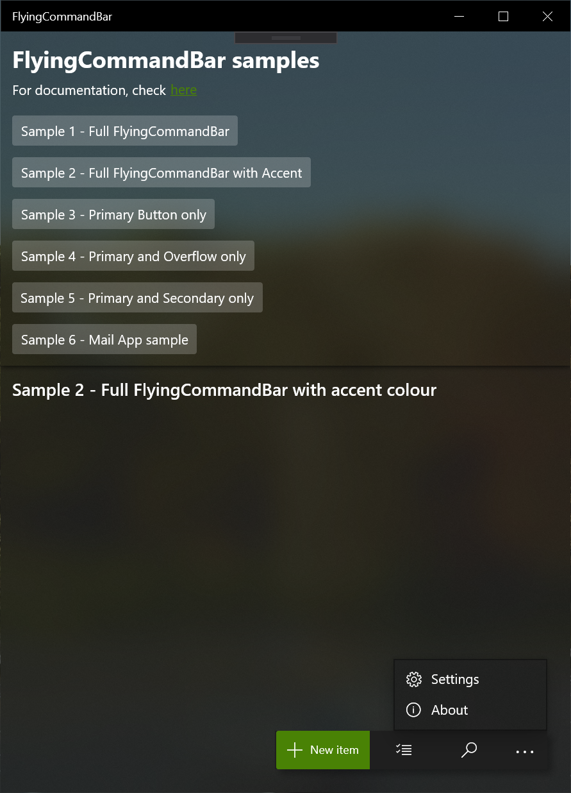
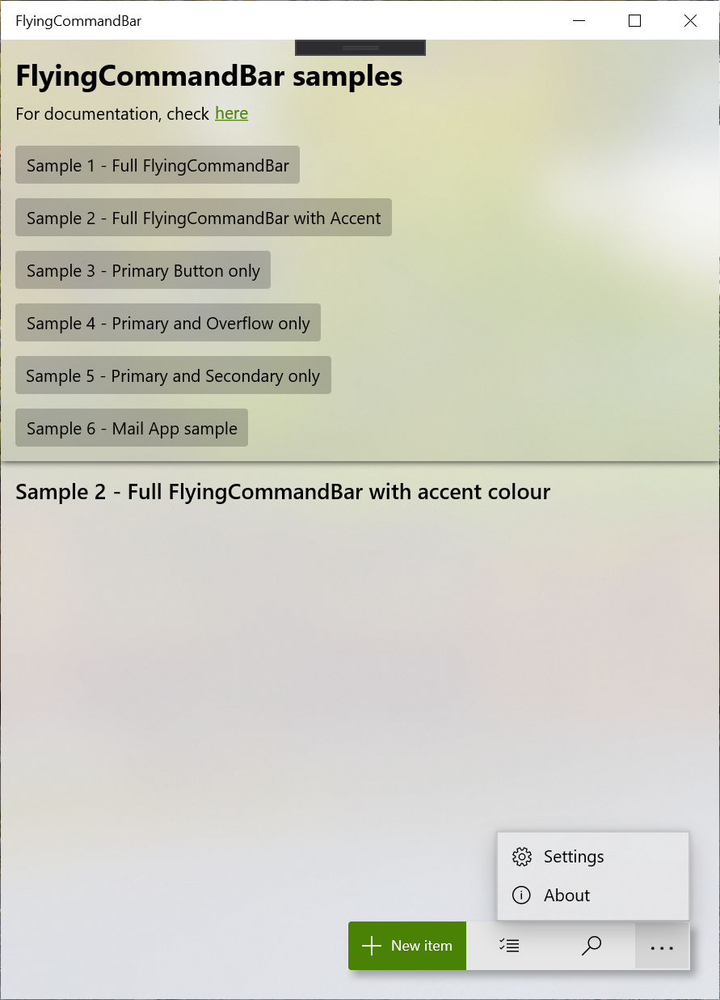

# DEMO-FlyingCommandBar
A XAML sample to showcase a set set of buttons that looks like a flying CommandBar

## Instructions
The detailed instructions about this sample can be found on my blog. 
* [About the design](https://www.ikarago.com/development/uwp-flyingcommandbar/)
* [About the implementation](https://www.ikarago.com/development/uwp-flyingcommandbar-revisited/)

## Support me
**Like this project?** [Buy me a coffee](https://paypal.me/ikarago) or support me on [Patreon](https://www.patreon.com/ikarago)!

## Screenshots

